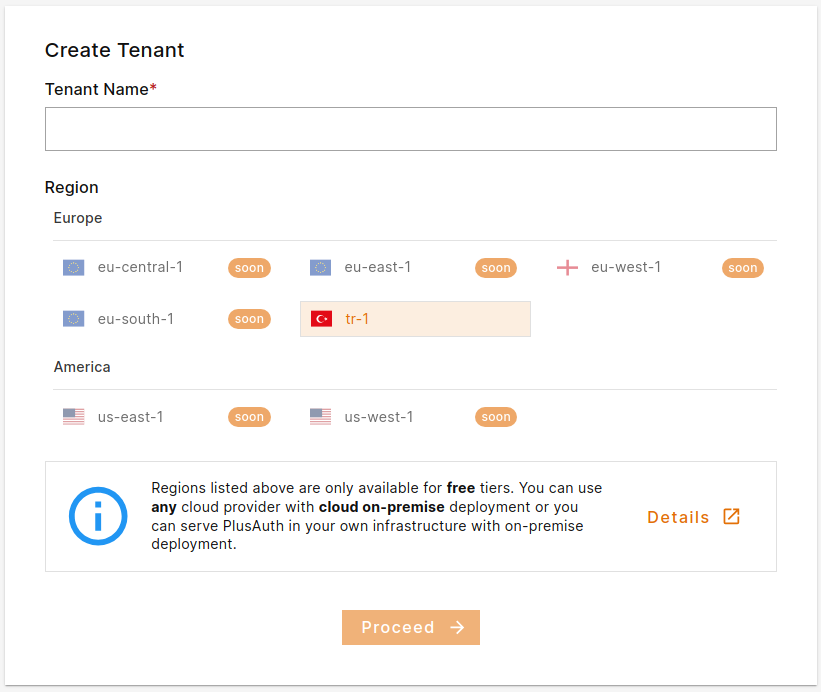

PlusAuth is structured as a multi-tenant solution. Each tenant has its own isolated space. To interact with PlusAuth you must create a tenant.

## Register to PlusAuth
If you don't have an account registered to PlusAuth start with [signin up](https://plusauth.com/signup). PlusAuth doesn't require
a credit-card or any payment for registration. You can register by providing your own credentials (email and password) or
with social providers.

## Creating Tenant
On the initial screen after you have created your account you will be prompted to
create a <GK entry="tenant"></GK>. You can create multiple tenants for different purposes or
different set of organizations/applications.

Your tenant name will be a subdomain of PlusAuth unless you create a <GK entry="custom domain">custom domain</GK>. For example:
`mytenantname.plusauth.com`

This hostname will be used to access to PlusAuth APIs and end-user facing endpoints such as Login, Register etc.

::alert{type=warning}
Tenant names cannot be changed after creation.
::

Tenant name must follow these rules:

- Tenant name must be **unique**.
- Tenant name can contain only **lowercase letters**, **numbers** and **hyphens** (-).
- Tenant name must be between **3** and **48** characters length.

After creating a tenant you can also create new tenants from the tenant menu in the
upper right corner of dashboard or by navigating to [Create Tenant](https://dashboard.plusauth.com/createTenant)
page.
