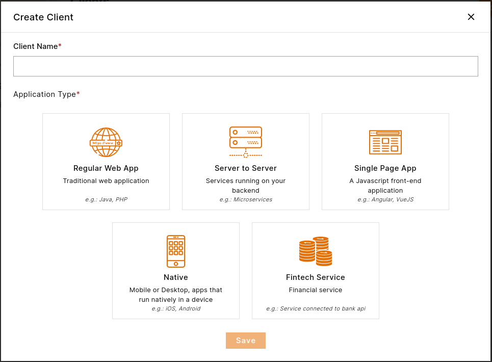

In order to start secure your applications you must define them to PlusAuth by creating a `Client`. A client can be any
application that has access to network. It could be a web application, mobile application,
desktop application, IoT device, an API (backend application) etc.

To create a **Client**  navigate to [Dashboard > Clients](https://dashboard.plusauth.com/#clients) and click 
to **Create** button.

Client creation requires a **Name** and an **Application Type**.

Name can be anything for you to identify your application.

Application types are as following:

1. **Regular Web Application**:
Regular web applications are traditional websites accessed through web browsers. They are hosted on 
servers and deliver content and functionality to users via a graphical user interface (GUI). 
Users interact with these applications by navigating through web pages and submitting forms.

2. **Server to Server**:
Server-to-server applications, also known as machine-to-machine (M2M) communication, 
involve the exchange of data and services between software applications running on different servers.

3. **Single Page Application (SPA)**:
Single Page Applications (SPAs) are web applications that load a single HTML page and dynamically update
content as users interact with the application. 

4. **Native Application (Mobile, Desktop, etc.)**:
Native applications are software programs developed for specific platforms or devices,
such as mobile phones, tablets, desktop computers, or wearables. 

5. **Fintech Service**:
Fintech services refer to financial technology applications and platforms that leverage cutting-edge technology
to deliver innovative financial products and services. These services may include online banking, mobile payment
solutions, peer-to-peer lending platforms, robo-advisors, and blockchain-based cryptocurrencies. 
  
If you are not sure about your application type, you can select **Regular Web Application** as it covers most cases.
