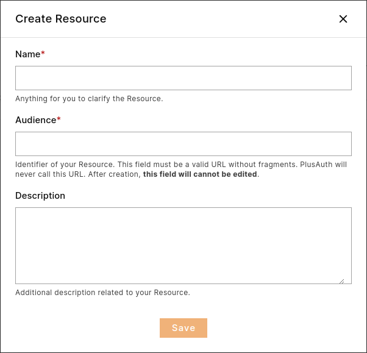

The **Resource** entity represents a logical or physical asset within your system that users
or entities seek to access or interact with. Thanks to the resources, you can control access to your system down to the
smallest detail.

To create a **Resource** navigate to [Dashboard > Resources](https://dashboard.plusauth.com/#resources) and click
to **Create** button.

Resource creation requires at least a **Name** and an **Audience**.

| Field                                        | Description                                                                                                                                                    |
|----------------------------------------------|----------------------------------------------------------------------------------------------------------------------------------------------------------------|
| \*Name     | Anything for you to clarify the Resource.                                                                                                                      |
| \*Audience | Identifier of your Resource. This field must be a valid URL without fragments. PlusAuth will never call this URL. After creation, this field cannot be edited. |
| Description                                  | Additional description related to your Resource.                                                                                                               |

