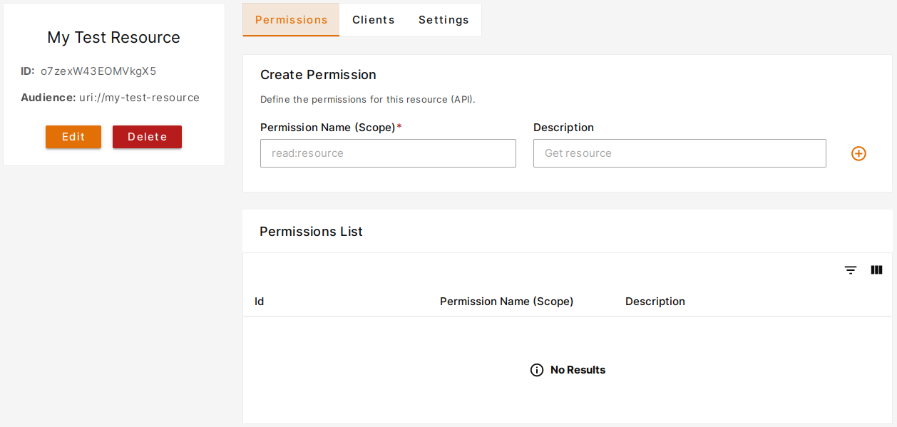
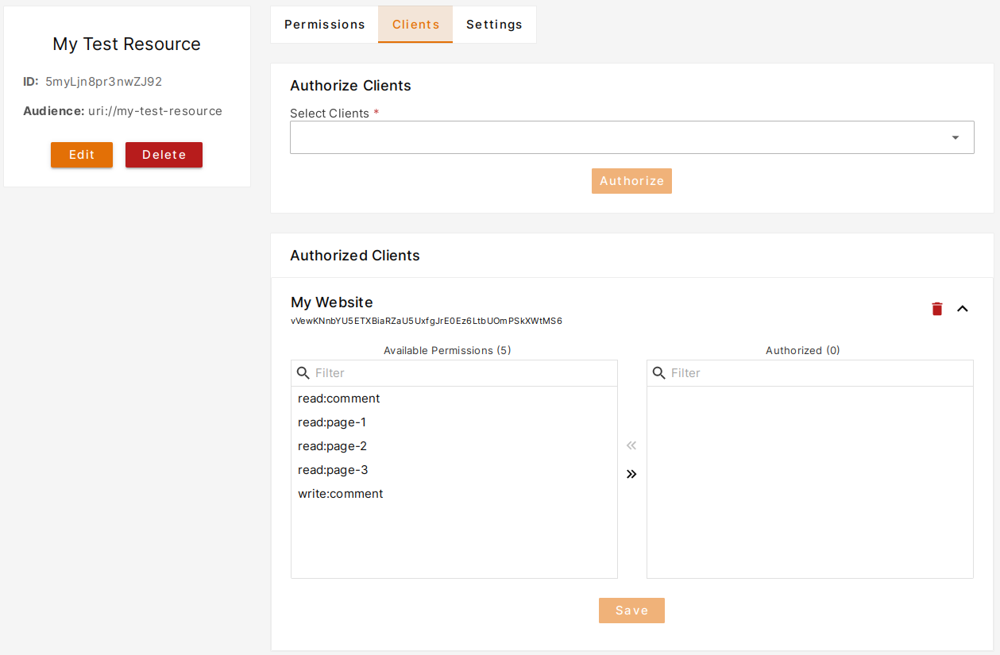

The **Resource** entity represents a logical or physical asset within your system that users
or entities seek to access or interact with. Thanks to the resources, you can control access to your system down to the
smallest detail.

To create a **Resource** navigate to [Dashboard > Resources](https://dashboard.plusauth.com/#resources) and click
to **Create** button.

Resource creation requires at least a **Name** and an **Audience**.

| Field                                        | Description                                                                                                                                                    |
|----------------------------------------------|----------------------------------------------------------------------------------------------------------------------------------------------------------------|
| \*Name     | Anything for you to clarify the Resource.                                                                                                                      |
| \*Audience | Identifier of your Resource. This field must be a valid URL without fragments. PlusAuth will never call this URL. After creation, this field cannot be edited. |
| Description                                  | Additional description related to your Resource.                                                                                                               |

## Define Permissions

After you create a resource, next step is to define permissions of that resource. In order to do that go to the details of the resource
and fill the form located in **Create Permission** section.

You can create as many as permissions you need for that resource.

## Allow Your Application to Access to the Resource

PlusAuth follows security-first approach and prevents access to resources from your applications by default.
You can allow access to a resource by going to **Dashboard > Resources > Your Resource > Clients** tab.

In that page you will se a combobox under **Authorize Clients** section. Type into that combobox the application
you would like to grant access to the resource. While typing you will see your clients related to your input and select the desired ones.

After selecting clients clicking **Authorize** you will see your selected clients appeared in
the **Authorized Clients** section as you can see from the below image.At this time your clients are allowed to
access to the resource but still you need to select permissions that could be requested from those clients.
PlusAuth allows a broader control over your applications and resources with these features.

After expanding your client from **Authorized Clients** section, just click to
the permissions you would like to allow and save by clicking **Save** button.

That's all it takes to define relationship between your resource and applications.
