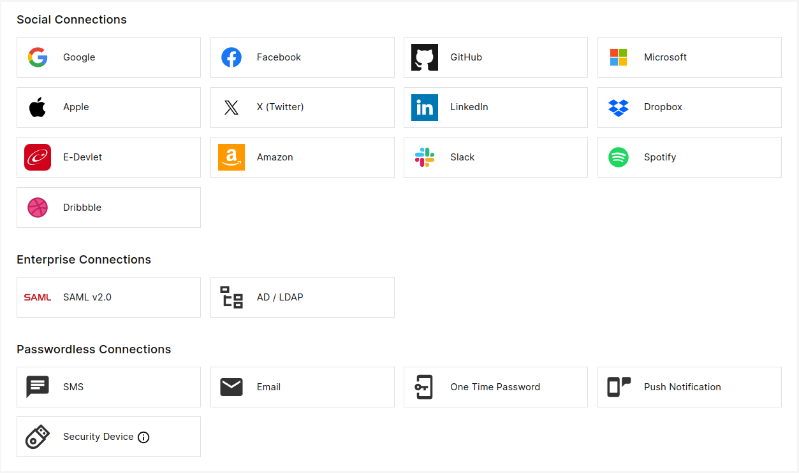

Social connections refer to the integration with social media platforms and identity providers (IdPs) to enable users 
to authenticate and access resources using their social media credentials. This integration allows users
to sign in to applications and services using their existing social media accounts, such as
Facebook, Google, Twitter, or LinkedIn, etc. instead of creating separate accounts for each service.

Upon successful authentication, user profile data retrieved from social connection will be converted to a PlusAuth 
user, so that you can still leverage user related PlusAuth features.

To create a Social Connection go to [Dashboard > Connections](https://dashboard.plusauth.com/#connections) and click
to the social connection button of your choice.

