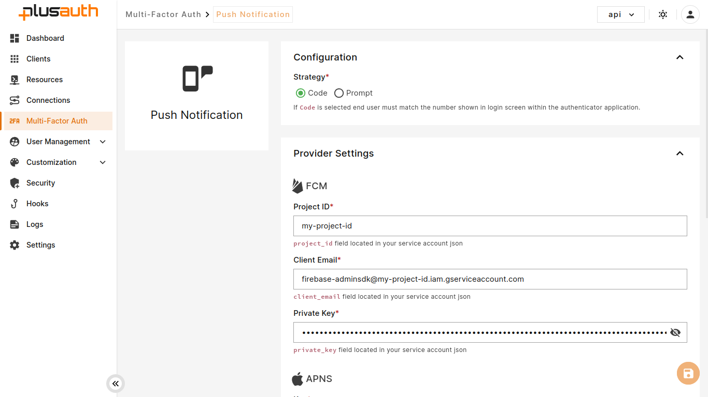

The AuthPlus SDK for iOS and Android allow you to build or integrate your own app to receive and interact with Push Notifications sent from PlusAuth.

To do so, you must configure push notifications in PlusAuth.

Firebase Cloud Messaging (FCM) facilitates instant delivery of notifications on Android devices, while Apple Push
Notification service (APNs) ensures seamless delivery to iOS devices.

## Configure push notifications for Android Devices

Firebase Cloud Messaging is a free notification delivery service provided by Google Firebase.

To enable the FCM integration, you need to get your service account key from
the [Firebase Console](https://console.firebase.google.com/).

### Generating a Service Account Key JSON

To acquire the account key JSON file for your service account

- Select your project, and click the gear icon on the top of the sidebar next to `Project Overview` navigation entry.
- Open `Project settings`.
- From settings page, navigate to the `Service Accounts` tab.
- Click to `Generate New Private Key`, then confirm by clicking Generate Key.
- Clicking `Generate Key` from the confirmation dialog, downloads the JSON file.

Your service account json should look like this:

```json
{
  "type": "service_account",
  "project_id": "<PROJECT_ID>",
  "private_key_id": "<PRIVATE_KEY_ID>",
  "private_key": "<PRIVATE_KEY>",
  "client_email": "<FIREBASE_ADMIN_SDK_EMAIL>",
  "client_id": "<CLIENT_ID>",
  "auth_uri": "https://accounts.google.com/o/oauth2/auth",
  "token_uri": "https://oauth2.googleapis.com/token",
  "auth_provider_x509_cert_url": "https://www.googleapis.com/oauth2/v1/certs",
  "client_x509_cert_url": "<CLIENT_X509_CERT_URL>",
  "universe_domain": "googleapis.com"
}
```

Now, you can configure your FCM provider.

### Configure PlusAuth Dashboard

- Go to [Dashboard > Multi-Factor Auth > Push Notification](https://dashboard.plusauth.com/~mfa/mfaForm?provider=push)
- Fill `FCM` section from `Provider Settings`

| Field        | Description                                               |
|--------------|-----------------------------------------------------------|
| Project Id   | `project_id` field located in your service account json   |
| Client Email | `client_email` field located in your service account json |
| Private Key  | `private_key` field located in your service account json  |




## Configure Push Notification for iOS Devices

[Apple Push Notification Service](https://docs.expo.dev/push-notifications/overview/), as the name suggests,
is a notification delivery service provided by Apple.

Apple provides two authentication methods to make a secure connection to APNs.
The first is Certificate-Based Authentication (using a .p12 certificate). The second is Token-Based Authentication (
using a .p8 key).
We’ll make use of the .p8 key.

To enable APNS integration, you need to create an [Apple Developer](https://developer.apple.com/) account with
an [Admin role](https://appstoreconnect.apple.com/access/users).

To generate the p8 key for your account:

- Head over to **Certificates, Identifiers & Profiles > Keys**.
- Register a new key and give it a name.
- Enable the Apple Push Notifications service (APNs) checkbox by selecting it.
- Click the **Continue** button and on the next page, select **Register**.
- Download the .p8 key file.

### Configure PlusAuth Dashboard

- Go to [Dashboard > Multi-Factor Auth > Push Notification](https://dashboard.plusauth.com/~mfa/mfaForm?provider=push)
- Fill `APNS` section from `Provider Settings`

| Field     | Description                                                                                                                                                               |
|-----------|---------------------------------------------------------------------------------------------------------------------------------------------------------------------------|
| Key       | .p8 key file contents of your Apple Developer account you have downloaded                                                                                                 |
| Key ID    | This is a 10-character unique identifier for the authentication key. You can find it in the key details section of the newly created key in your Apple developer account. |
| Team ID   | This is available in your Apple developer account.                                                                                                                        |
| Bundle ID | This is the ID of your app. You can find it in the app info section of your Apple developer account.                                                                      |
