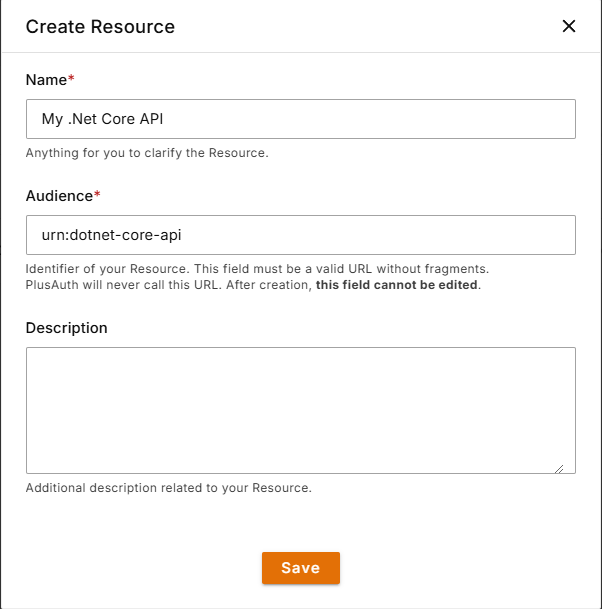

This tutorial shows how to add authorization to ASP.Net Core Rest API with PlusAuth. If you do not have a PlusAuth account, register from [here](https://dashboard.plusauth.com).
We will be using [.NET Core Security Framework](https://learn.microsoft.com/en-us/aspnet/core/security/?view=aspnetcore-7.0).

## Configure PlusAuth
### Define your API (Resource)

Go to [PlusAuth Dashboard > Resources](https://dashboard.plusauth.com/~resources) and create a new resource by clicking the **Create** button.




### Define Permissions

Permissions play a crucial role in governing access to resources, ensuring that only authorized users or applications
interact with sensitive data or functionalities.

You can define allowed permissions in the Permissions view from the Resource details.

For this example we will be using `read:weather` scope.


## Create an API
We will be using the built-in `WeatherForecast` example project, but if you already have an API, you can use that instead.

Generate the project by using `dotnet` cli tool and add the necessary dependencies:

```shell
dotnet new webapi -o plusauth-dotnet-api-starter
cd plusauth-dotnet-api-starter
dotnet add package Microsoft.AspNetCore.Authentication.JwtBearer
```

::alert{type=warning}
Make sure you have installed [Microsoft.AspNetCore.Authentication.JwtBearer](https://www.nuget.org/packages/Microsoft.AspNetCore.Authentication.JwtBearer/7.0.15)
package compatible to your ASP.NET version. For example, for `ASP.NET 7.x`, package version should be `7.x.x`
::

### Configure Settings

Add following section to your `appsettings.json`. **Audience** parameter should be the same with your 
resource's audience we created in [Configure PlusAuth/Define your API](#define-your-api-resource) step

::code-group
```json [appsettings.json]
"PlusAuth": {
  "Issuer": "https://{YOUR_PLUSAUTH_TENANT_ID}.plusauth.com",
  "Audience": "urn:dotnet-core-api"
}
```
::

### Configure JWT Authorization
In your `Program.cs` file register **JwtBearer** authentication scheme and
add the authentication and authorization middleware to the middleware pipeline by using 
`UseAuthentication` and `UseAuthorization` methods:

::code-group
```csharp [Program.cs]
/* ~~Redacted for simplicity~~ */

builder.Services.AddAuthentication(JwtBearerDefaults.AuthenticationScheme)
  .AddJwtBearer(options =>
  {
    options.Authority = builder.Configuration["PlusAuth:Issuer"];
    options.Audience = builder.Configuration["PlusAuth:Audience"];
  });
  
/* ~~Redacted for simplicity~~ */
  
var app = builder.Build();

app.UseAuthentication();
app.UseAuthorization();

/* ~~Redacted for simplicity~~ */
```
::

### Apply Permission (Scope) Policy
After configuring JWT Authorization we need to check the required scopes for each controller/action. We will be using 
[Policy-Based Authorization](https://docs.microsoft.com/en-us/aspnet/core/security/authorization/policies)
provided by ASP.NET Core.

By default, ASP.NET Core does not have a scope authorization requirement, so we should create our own authorization requirement.
This requirement will check if `scope` claim exists, and it contains the required scope provided by policy.

Creating following files:

::code-group
```csharp [ScopeAuthorizationHandler.cs]
using Microsoft.AspNetCore.Authorization;

namespace plusauth_dotnet_api_starter;

public class ScopeAuthorizationHandler : AuthorizationHandler<ScopeRequirement>
{
  protected override Task HandleRequirementAsync(
    AuthorizationHandlerContext context, 
    ScopeRequirement requirement
  )
  {
    var scopeClaim = context.User.FindFirst(c => c.Type == "scope" && c.Issuer == requirement.Issuer);
    // If user does not have the scope claim, get out of here
    if (scopeClaim == null)
      return Task.CompletedTask;

    // Scopes are set of space separated strings. Split them by space...
    var scopes = scopeClaim.Value.Split(' ');
    
    // Check if the list of scopes contains the required scope
    if (scopes.Any(s => s == requirement.Scope))
      context.Succeed(requirement);

    return Task.CompletedTask;
  }
}
```
```csharp [ScopeRequirement.cs]
using Microsoft.AspNetCore.Authorization;

namespace plusauth_dotnet_api_starter;

public class ScopeRequirement : IAuthorizationRequirement
{
  public string Issuer { get; }
  public string Scope { get; }

  public ScopeRequirement(string scope, string issuer)
  {
    Issuer = issuer ?? throw new ArgumentNullException(nameof(issuer));
    Scope = scope ?? throw new ArgumentNullException(nameof(scope));
  }
}
```
::


After creating authorization requirements as provided above, all we need to do is define our policies. 
In your `Program.cs` define your policies with `AddAuthorization` method. For each scope you have, call
the `AddPolicy` method and use our newly created `ScopeRequirement`. Finally, register `ScopeAuthorizationHandler` as a singleton.


In this tutorial we have created **read:weather** scope (permission),
so the code block would look like this.

::code-group
```csharp [Program.cs]
/* ~~Redacted for simplicity~~ */

builder.Services.AddAuthorization(options =>
{
  options.AddPolicy("read:weather", policy => policy.Requirements.Add(
    new ScopeRequirement(
      "read:weather", 
      builder.Configuration["Authorization:Issuer"]
    )
    ));
});
builder.Services.AddSingleton<IAuthorizationHandler, ScopeAuthorizationHandler>();

/* ~~Redacted for simplicity~~ */

```
::


### Protect Your Endpoints

To secure our endpoints, we need to use `[Authorize]` attribute with our policy name which is **read:weather** in this tutorial.

::code-group
```csharp [Controllers/WeatherForecastController.cs]
/* ~~Redacted for simplicity~~ */

public class WeatherForecastController : ControllerBase
{
  
  /* ~~Redacted for simplicity~~ */

  [HttpGet(Name = "GetWeatherForecast")]
  [Authorize("read:weather")]
  public IEnumerable<WeatherForecast> Get()
  {
     // handle request
     /* ~~Redacted for simplicity~~ */
  }
}

```
::

Now, our endpoint expects a JWT access token provided by `Authorization` header using `Bearer` scheme and contains **read:weather** scope.
