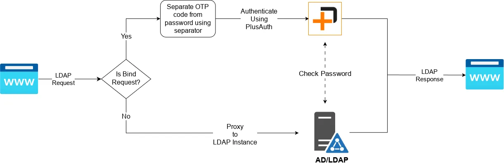

Legacy applications that directly connect to AD/LDAP using LDAP clients can now benefit from an additional layer
of security. Our proxy ensures that every authentication request is routed through PlusAuth, enabling MFA
to protect against unauthorized access and potential security breaches.


## Usage

After you download release from [releases](./releases) run the application with a parameter pointing to your config file.
For configuration file reference, have a look at to [Configuration](#configuration) section.

```shell
> ./ldap-proxy --config ldap-proxy-config.json
```

Following flow is applicable when MFA enabled in configuration for a ldap server instance:
  {class="w-full"}

## Pre-Requisites
As you have seen in the flow above LDAP Proxy must communicate with LDAP server as well as PlusAuth. Following steps
are required in order to configure LDAP Proxy to work flawlessly.

In PlusAuth Dashboard:

- Create a **Client** with type of `Server to Server Application`
  - Enable `password` Grant Type 
  - Enable **Grant Types** corresponding to your preferred MFA method/s. For example, if you are going to use **SMS**, you have to enable `urn:plusauth:params:oauth:grant-type:mfa-sms` grant type.   
- Create an **AD/LDAP Connection** from [Dashboard > Connections](https://dashboard.plusauth.com/#conenctions)
  - Configure AD/LDAP Connection to be able to connect your AD/LDAP Server. 
  - In **Enabled Clients** section make sure you have included the client we have created in the last step.
- Enable one of **Multi-Factor Authentication (MFA)** methods. Currently supported methods are `SMS`, `Email`, `OTP` and `Push`

Now you are ready to configure your LDAP Proxy.

## Configuration
Ldap Proxy uses `json` as configuration file format. Here is configuration file reference:

```json5
{
  log_level: "info", // one of  'trace', 'debug','info','warn','error','silent'. Defaults to 'info'
  server: {
    domain: "plusauth.com", // base domain for the proxy. Defaults to "plusauth.com"
    hostname: "0.0.0.0", // hostname for the proxy. Defaults to "127.0.0.1"
    port: 8389, // port for the proxy. Defaults to 8389
    certificate: {
      cert_file: '/path/to/cert.pem', // File path pointing to certificate for the proxy server in pem format.
      key_file: '/path/to/key.pem', // File path pointing to private key for the proxy server in pem format.
    },
    allow_insecure_certificates: false, // Allow self-signed or untrusted certificates. Defaults to false
  },
  plusauth: {
    domain: "plusauth.com", // Your PlusAuth instance's base domain. Defaults to "plusauth.com"
  },
  // An array containing your AD/LDAP server's configuration
  ldap_servers: [
    {
      uri: "ldap://localhost:389", // LDAP server URI with format of <ldap/s>://<host>:<port>
      // We need to map your AD/LDAP server to plusauth with following configuration.
      plusauth: {
        tenant_id: "<your-tenant-id>", // Your PlusAuth tenant id.
        connection_name: "my-connection-name", // Created connection's name. Will be used as subdomain for the proxy.
        client_id: "<your-client-id>", // Created client's id
        client_secret: "<your-client-secret>", // Created client's secret
        mfa: {
          enabled: true, // Whether enable MFA for this AD/LDAP or not. Defaults to true
          method: "otp", // Preferred MFA method. One of "otp", "sms", "push", "email". Defaults to "otp"
          separator: "|", // A string separator for separating OTP code from password. Defaults to " " (a single space character)
        }
      },
    }
  ]
}
```

With the above configuration you would access to your LDAP Proxy with `ldaps://my-connection-name.plusauth.com:8389`. 
For example:
```shell
> ldapsearch -L -H ldaps://my-connection-name.plusauth.com:8389  -x -D cn=user,dc=example,dc=org -w "password|otp" -b "dc=example,dc=org" -s sub "*"
```

::alert{type=warning}
Make sure your application can reach to LDAP Proxy. Change `server.domain` and `server.hostname` accordingly.
::
