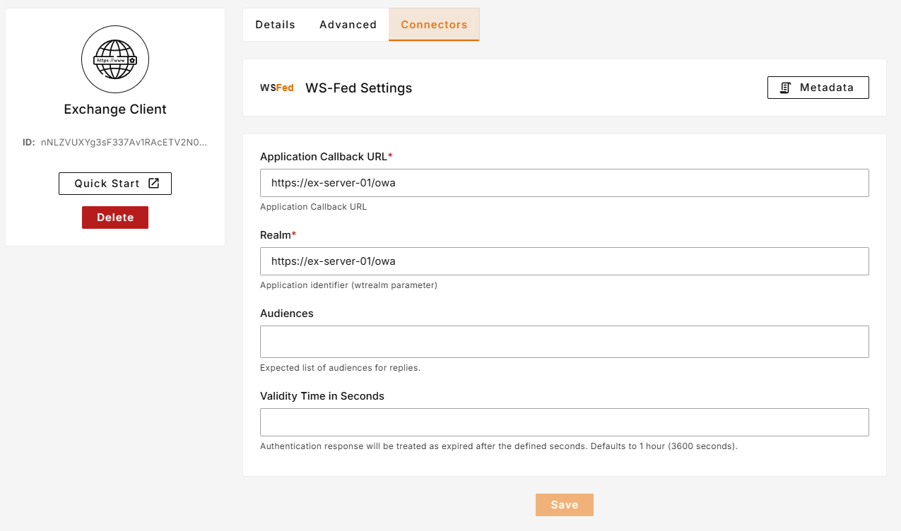

- Go to Dashboard > Clients and Create a new Client by clicking "Create" button
- Create a Regular Web App client with any name 
- Go to created client details and "Connectors" tab
- Select WS-Fed
- Enter the following information in the respective fields.
  - **Realm**: `https://{owa-url}` e.g. https://mail.example.com/owa/
  - **Application Callback URL**: `https://{owa-url}` e.g. https://mail.example.com/owa/ 

- Click to **Download Certificate** button and save it to your exchange server.
- Save **Certificate Thumbprint** to somewhere as we will use it in later steps.
- Add above certificate (obtained in above step) to the Trusted People store on the Exchange Server using the steps below:
  - Got to `Management Console`. Open run dialog (Win + R) and type `mmc` and press enter.
  - In Management Console, go to `File > Add or Remove Snap-ins (Ctrl + M)`.
  - Search for `Certificates` on the left side and press Add.
  - In the Certificate Snap In window, select `Computer account` and press Next. Then select `Local Computer` and press Finish.
  - You will see an entry for `Certificates (Local Computer)` in the right pane. Click OK to close the Add or Remove Snap-ins window.
  - You will see a branch named `Certificates` created under `Console Root`. Expand the `Certificates` branch and select `Trusted People`.
  - Right click on `Trusted People > Find > Import` and click on Next.
  - Choose the location of the downloaded certificate file you created above and click on Next, again Next and Finish.
  - You have successfully added a Signing Certificate to Trusted People. Now close Management Console and choose No on the Save data prompt.

- Execute the commands below on the Exchange Server using the `Exchange Management Shell`.
  - In the below command, `##Base URL##` is the exchange/OWA host. The command has both URLs: One ending in / and the other one which does not contain a trailing slash.
    ```shell
    $uris=@("https://##Base URL##/owa/","https://##Base URL##/ecp/","https://##Base URL##/owa","https://##Base URL##/ecp")
    ```
  - In the below command, the `##PlusAuth Issuer##` is the WS-Federation Reply URL. The `##Cert Thumbprint##` is the **SHA-1 Thumbprint** of the certificate you downloaded. You can copy these values from PlusAuth Dashboard where we have configured WS-Fed in above steps.
    ```shell
    Set-OrganizationConfig -AdfsIssuer "##PlusAuth Issuer##" -AdfsAudienceUris $uris -AdfsSignCertificateThumbprint "##Cert Thumbprint##"
    ```
  - Now we are disabling other authentication mechanisms to let PlusAuth handle it.
    ```shell
    Get-EcpVirtualDirectory | Set-EcpVirtualDirectory -AdfsAuthentication $true -BasicAuthentication $false -DigestAuthentication $false -FormsAuthentication $false -WindowsAuthentication $false
    ```
    ```shell
    Get-OwaVirtualDirectory | Set-OwaVirtualDirectory -AdfsAuthentication $true -BasicAuthentication $false -DigestAuthentication $false -FormsAuthentication $false -WindowsAuthentication $false -OAuthAuthentication $false
    ```
  - Finally, restart services to apply these changes.
    ```shell
    # Restart w3svc and was
    net stop was /y
    net start w3svc
    ```


2. Create AD/LDAP Connection
- Go to `Dashboard > Connections`
- Create a new `AD / LDAP` Enterprise connection
- Enter name, and select the client created above.
- Fill required fields according to your AD/LDAP connection.
  - **Search Filter**: Enter LDAP filter to find user with parameter submitted from login page. Ex. `(mail={{username}})`
  - 
- After creating connection make it default by toggling `Default Connection`

::alert{type="info"}
  You can use following command to get your AD user's all attributes. Replace `##Username##` with a valid username.
```shell
get-aduser ##Username## -Properties *
```
::

3. Test login
   - Go to owa login page
