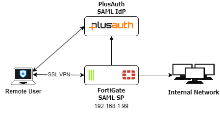
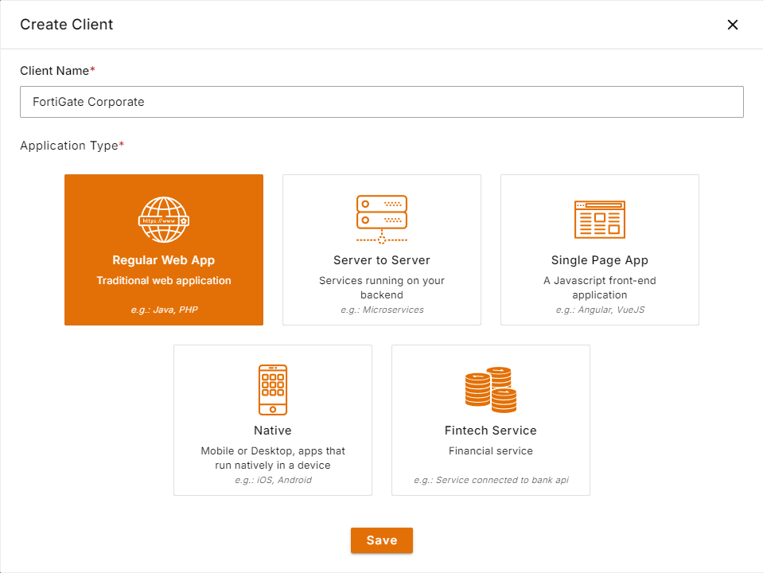

The following shows the topology in this configuration:

{height="400px"}

The authentication process is as follows in this deployment:

1. The user initiates an SSL VPN request to the FortiGate.
2. The FortiGate sends the browser POST redirect to FortiClient.
3. FortiClient redirects the SAML authentication request to PlusAuth.
4. The user authenticates with Okta using their credentials.
5. PlusAuth sends a SAML assertion that contains the user and group authentication in a POST redirect to the SSL VPN
   login page.
6. FortiClient sends the redirected PlusAuth request that contains the SAML assertion to the FortiGate.
7. The FortiGate consumes the assertion and provides the user with access to resources based on the defined firewall
   security policy.

The example assumes that you already have a PlusAuth account.
This example uses users locally defined within the PlusAuth and your plan allows SAML connections.

## Configure PlusAuth for SSL VPN with FortiOS

1. Log in to the PlusAuth dashboard as the registered user.
2. Add the FortiGate application:
    1. Go to [Clients](https://dashboard.plusauth.com/#clients) and create a **Regular Web App** with any name by clicking **Create** button
        
    2. Go to **Connectors** tab from client details and click **SAML2**
    3. Configure SAML settings:
        1. In **Entity ID** field write down `https://<FortiGate IP address>:<port>/remote/saml/metadata/`. In this example, it is `https://192.168.1.99:10443/remote/saml/metadata/`
        2. In the **Consumer Service URL** enter `https://<FortiGate IP address>:<port>/remote/saml/login/`. In this example, it is `https://192.168.1.99:10443/remote/saml/login/`
        3. If you would like to use signed assertions upload or paste **SP certificate** explained in the table ove to the **Signing Certificate** field.
        4. Turn on **Sign Out Enabled** and enter `https://<FortiGate IP address>:<port>/remote/saml/logout/` to the **Sign Out Url**. In this example, it is `https://192.168.1.99:10443/remote/saml/logout/`
    4. In **User Object Mapping** section make sure following SAML assertions exists:
       ```json
          "id": "http://schemas.xmlsoap.org/ws/2005/05/identity/claims/nameidentifier",
          "email": "email",
          "roles": "groups",
          "username": "username"
       ```
       With this mapping we are ensuring assigned roles to user will be available to FortiGate under `groups` assertion.
    5. Click to Save button to apply changes.
    6. Click to **Metadata** button and download the certificate.
3. Create User and Role
    1. Go to [Users](https://dashboard.plusauth.com/#users) and create a user with an email address.
    2. Go to [Roles](https://dashboard.plusauth.com/#rbac/roles)
        1. Create a role. In this example we will be using `corporate-role`.
        2. Assign it to the user from the **Users** tab in the role details page.


## Configure FortiGate

1. Upload the certificate downloaded from client metadata to FortiGate
  1. Go To **System > Certificates**
  2. Click to **Create/Import > Remote Certificate**
  3. Upload the certificate and click to OK. The uploaded certificate name will be assigned automatically by Fortigate. In this example, it is `REMOTE_Cert_1`

2. Configure the FortiGate SP to be a SAML user:
  ```shell
  config user saml
    edit "plusauth-idp"
      set entity-id "https://192.168.1.99:10443/remote/saml/metadata/"
      set single-sign-on-url "https://192.168.1.99:10443/remote/saml/login"
      set single-logout-url "https://192.168.1.99:10443/remote/saml/logout"
      # You can see these values from the SAML Connector settings page by clicking Metadata button
      set idp-entity-id "urn:forti.plusauth.com:saml:<PlusAuth Client Id>"
      set idp-single-sign-on-url "https://fortinet.plusauth.com/p/saml/<PlusAuth Client Id>/signin"
      set idp-single-logout-url "https://fortinet.plusauth.com/p/saml/<PlusAuth Client Id>/logout"
      set idp-cert "REMOTE_Cert_1"
      # If you would like to use username field replace the value according to your mappings
      set user-name "email"
      set group-name "groups"
    next
  end
  ```

3. Configure user group assertion on PlusAUth as part of the SAML assertion attributes. It is important that the group attribute value received is locally matched with the `group-name` value:
```shell
config user group
  edit "corporate-saml"
      set member "plusauth-idp"
      config match
        edit 1
          set server-name "plusauth-idp"
          ## Notice that the group name must be the same with the created PlusAuth role.
          set group-name "corporate-role"
      next
    end
  next
end
```
4. Go to **VPN > SSL-VPN Settings**. Configure VPN settings as desired. In this example the port `10443` is used. If you wish to use different port, change the related configurations accordingly. 
   When testing the VPN solution, starting with a web-based configuration, 
   then moving to a tunnel-based configuration is recommended. 
   Web-based testing can help in troubleshooting.
5. Go to **Policy and Objects > Firewall Policies**. Configure a policy as desired.
6. Increase the global authentication timeout period to allow users to fill in their credentials in time. The default timeout is five seconds:
```shell
config system global
  set remoteauthtimeout 120
end
```

## Troubleshooting Tips
- **Enable debugging for 'SAML'** 
    ```shell
    diagnose debug console timestamp enable
    diagnose debug application samld -1 
    diagnose debug enable
    ```
    To disable debug:
    ```shell
    diagnose debug application samld 0
    diagnose debug disable
    diagnose debug reset
    ```

- **Enable debugging for 'SSL VPN':**
    ```shell 
    diagnose debug console timestamp enable
    diagnose debug application sslvpn -1
    diagnose debug enable
    ```
    To disable debug:
    ```shell
    diagnose debug application sslvpn 0
    diagnose debug disable
    diagnose debug reset
    ```
- **List current SSL VPN connections**
    ```shell
    execute vpn sslvpn list
    ```
- **Check SAML metadata**
    ```shell
    diagnose vpn ssl saml-metadata "Your_SAML" <----- For SSL VPN.
    # diagnose sys saml metadata            <----- For admin access.
    ```